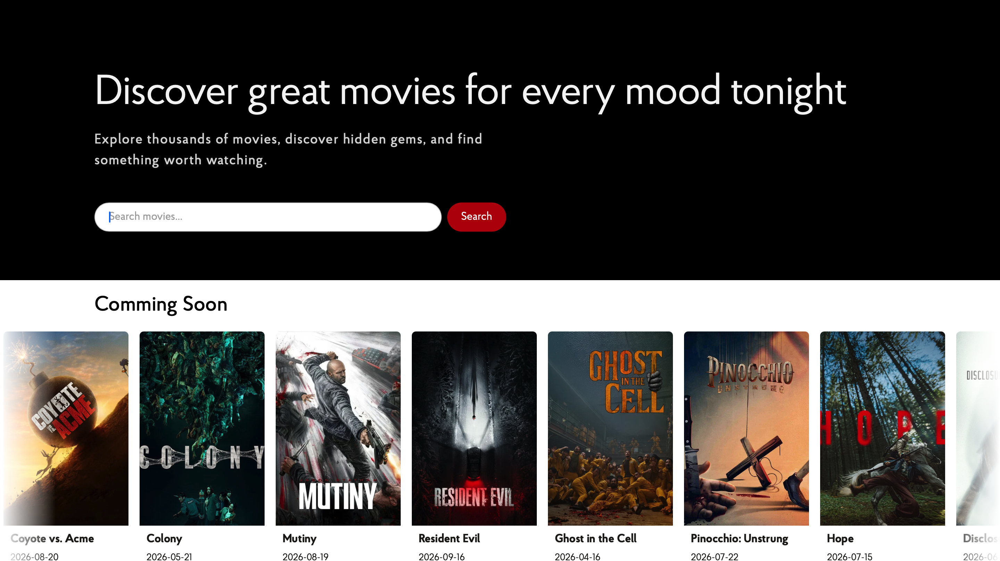

# 🎬 Movix Search App

A modern movie search web application built with **React and TypeScript**, using the **TMDB API** to search and discover movies.

The application allows users to search for movies, browse results with pagination, explore trending and upcoming movies, and view detailed movie information through a responsive and user-friendly interface.



## Live Demo

<a href="https://movix-search-app.vercel.app" target="_blank">

## Features

- 🔎 Search for movies using the TMDB database
- 🎬 Browse popular and trending movies
- 🍿 Explore upcoming movies
- 📄 Pagination for search results
- ⚡ Asynchronous API requests with **Axios**
- 🔄 Server-state management with **TanStack React Query**
- 🪝 React Hooks — `useState`, `useEffect`, and `useQuery`
- 🎞️ Interactive movie carousel using **Swiper**
- 📱 Responsive design for different screen sizes
- 🎨 Scoped styling with **CSS Modules**
- ⏳ Loading and error states
- 🔔 User notifications for search and API-related events

## Tech stack

- **React**
- **TypeScript**
- **Vite**
- **TanStack React Query**
- **Axios**
- **Swiper**
- **CSS Modules**
- **TMDB API**

## 🧠 What I Practiced

This project helped me practice working with:

- React functional components
- React Hooks and component state
- Asynchronous API requests
- REST APIs
- Server-state management with React Query
- Query caching and pagination
- TypeScript interfaces and type safety
- Component composition and reusable UI
- Responsive layouts
- CSS Modules
- Third-party library integration

## 📂 Project Structure

The project is organized into reusable components, assets, services, and types to keep the codebase maintainable and easy to extend.

```text
src/
├── assets/
├── components/
│   ├── AppBody/
│   ├── ComingSoon/
│   ├── Container/
│   ├── ErrorMessage/
│   ├── Footer/
│   ├── Hero/
│   ├── Loader/
│   ├── Modal/
│   ├── MovieGrid/
│   ├── Pagination/
│   ├── SearchBar/
│   ├── TrendingMovieGrid/
│   └── App.tsx
├── services/
│   └── movieService.ts
├── types/
│   └── note.ts
├── index.css
└── main.tsx
```

## 📡 API

Movie data is provided by **The Movie Database (TMDB) API**.

The application communicates with the API through Axios and uses React Query to manage fetching, caching, loading, and error states.

## 📌 Project Status

The project is actively being improved as part of my ongoing **React and TypeScript learning journey**.

---

Built with ❤️ using **React, TypeScript and TMDB API**.
